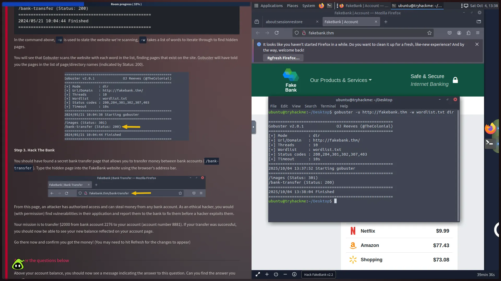
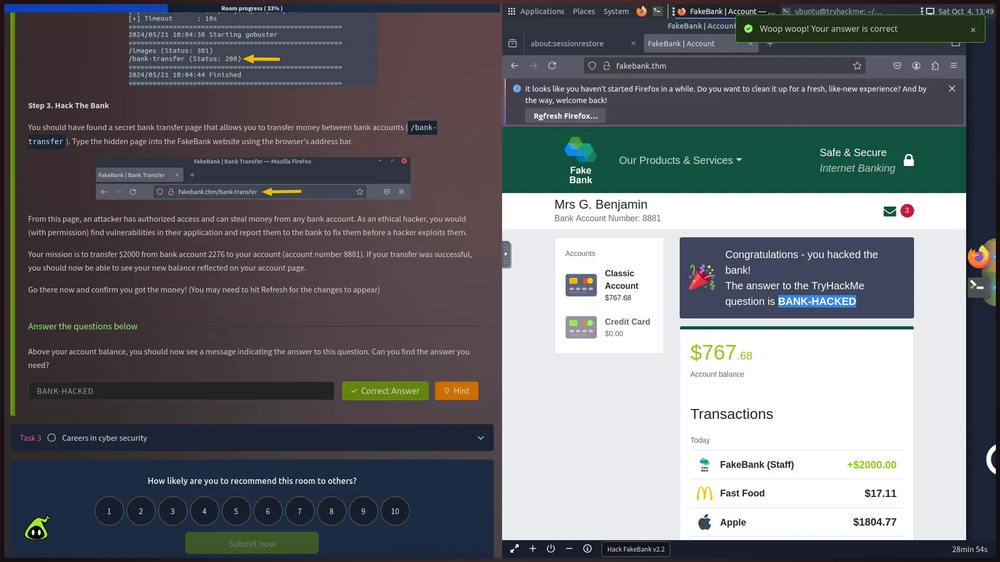
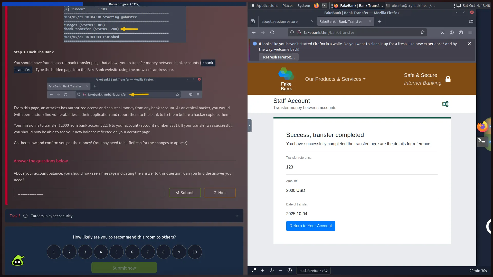
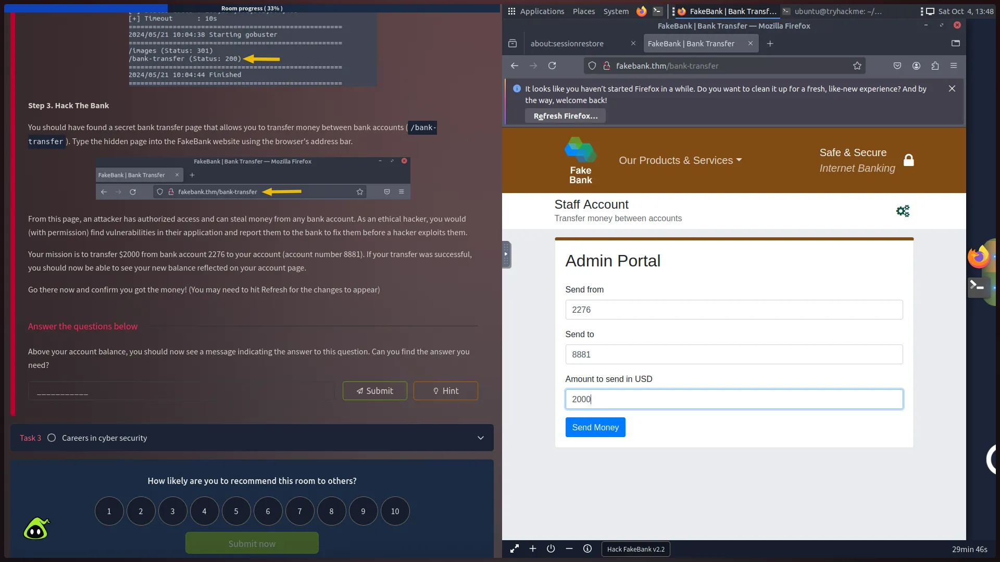

## 📝 TryHackMe Write-up: Exploiting FAKEBANKTHM for Offensive Security Introduction

This write-up documents the step-by-step process of completing the "FAKEBANKTHM" challenge from the TryHackMe Offensive Security Introduction room. The goal was to demonstrate fundamental web application reconnaissance and exploit a vulnerability to capture the flag.

---

## **TASK 1: Initial Instructions & Setup**

I began by reading the challenge instructions to understand the scope and objective: to identify and exploit a vulnerability in the simulated banking application, **FAKEBANKTHM**, to complete an unauthorized bank transfer.

---

## **TASK 2: Reconnaissance and Exploitation**

This task involved active reconnaissance to discover hidden endpoints, followed by exploiting a weak access control mechanism to achieve the objective.

### **STEP 1. Define Objective**

The objective was to perform a transfer and **capture the flag** in the virtual environment.

### **STEP 2. Directory Brute-Forcing with Gobuster**

I utilized the command-line tool **Gobuster** to perform a directory brute-force attack on the target application. This technique is crucial for **discovering hidden or unlinked pages** that might lead to a vulnerability.

- **Tool Used:** `Gobuster` (Directory/file/VHost/DNS brute-forcer)
    
- **Purpose:** To systematically guess and check for valid directory paths on the server.
    
- **Key Finding:** The scan revealed two important endpoints:
    
    - `/images` (Status: 301 - Redirect)
        
    - **`/bank-transfer` (Status: 200 - OK)**
        

The `200 OK` status for **`/bank-transfer`** was the critical finding, indicating a functional page that could be accessed directly, likely bypassing standard application flow and security checks.

### **STEP 3. Defining the Exploit Parameters**

The exploit required a precise target and source account. The vulnerability allows for an **Insecure Direct Object Reference (IDOR)** or **client-side enforcement bypass**, by accessing a sensitive function directly.

- **Objective:** Transfer **$2000**
    
- **Source Account (Restricted):** `2276`
    
- **Destination Account (My Account):** `8881`
    

### **STEP 4. Execution of Funds Transfer and Flag Capture**

I navigated directly to the discovered `/bank-transfer` endpoint, input the specific details, and submitted the request.

- **Result:** The transfer successfully completed, and the new balance was reflected on the account page.
    
- **Captured Flag:** **`BANK-HACKED`**
    

---

## **TASK 3: Conclusion and Technical Reflection**

### **STEP 1. Review and Analysis**

I reviewed the outcome and continued the flow of the TryHackMe room. No further answers were required in this section.

### **Reflection on the Vulnerability**TASK 1:

I read instruction and answered the question (Offensive Security).

---

## **WORDLIST: Technical Terminology**

- **GOBUSTER:** A tool used to brute force directories, files, DNS, and virtual host names on target web servers. It systematically checks a wordlist against the target to find valid paths.
    
- **Insecure Direct Object Reference (IDOR):** A type of access control vulnerability that arises when an application uses user-supplied input to access an object directly (like an account number or file name) without sufficient authorization checks.  